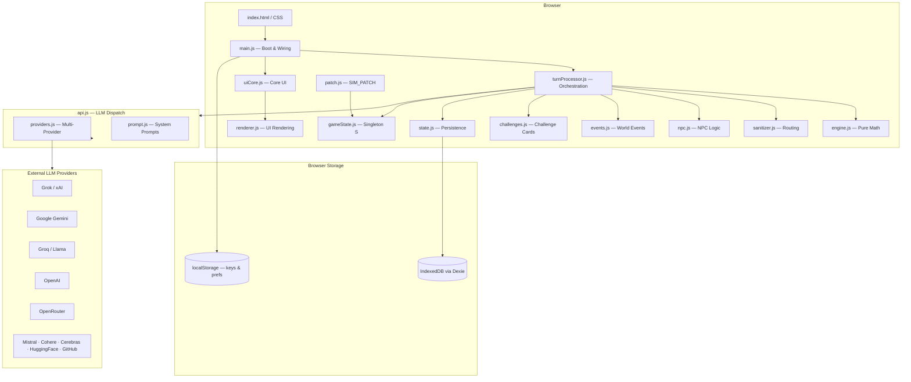
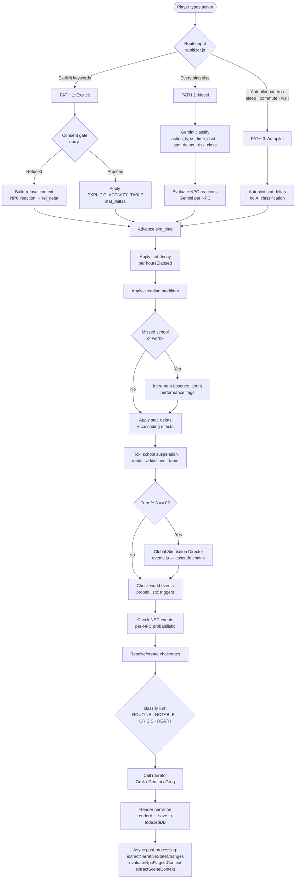
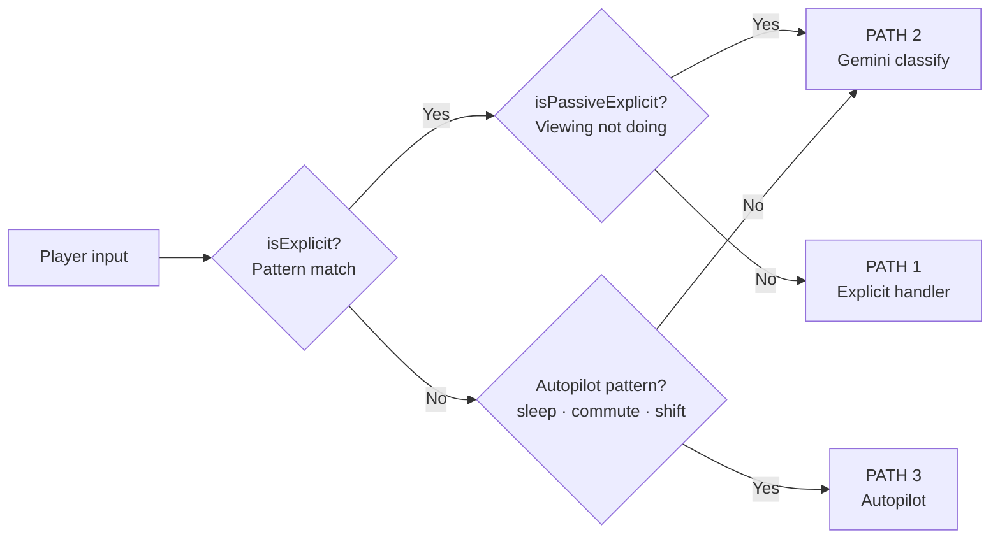
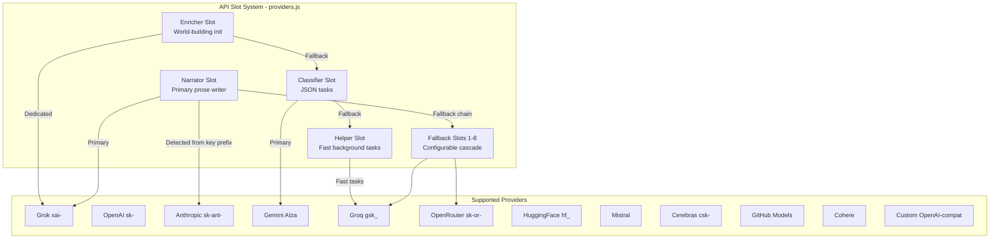
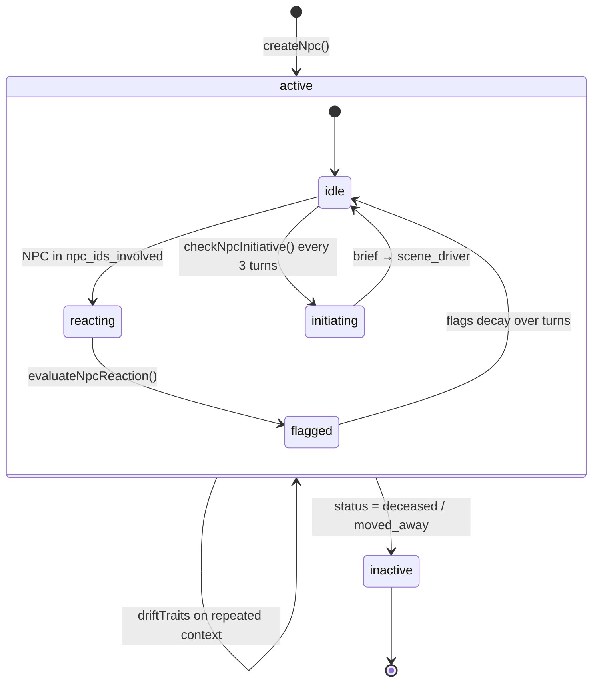
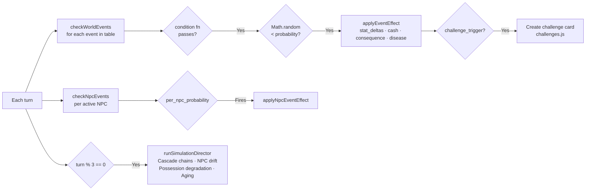
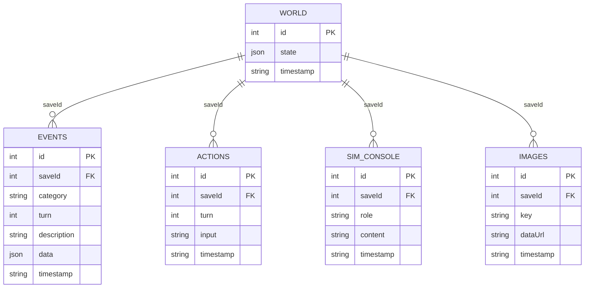
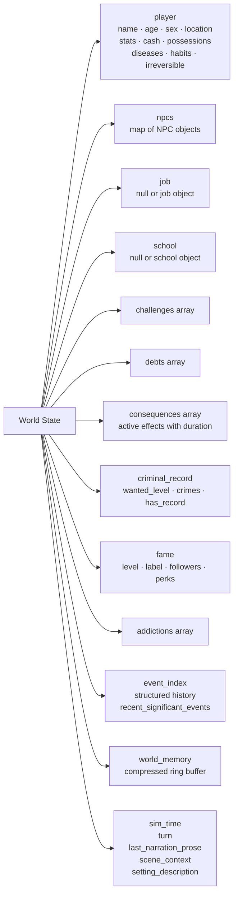

# The Sim

A text-driven adult life simulation game powered by large language models. You play as a character navigating daily life — work, school, relationships, health, finances, and more — in a fully simulated world that runs on its own rules regardless of your choices.

> **Stack:** Vanilla JS ES Modules · IndexedDB (Dexie.js) · Multi-provider LLM abstraction · PWA

---

## Table of Contents

- [Quick Start](#quick-start)
- [Architecture Overview](#architecture-overview)
- [File Structure](#file-structure)
- [Core Systems](#core-systems)
  - [Turn Engine](#turn-engine)
  - [Routing System](#routing-system)
  - [Provider Abstraction](#provider-abstraction)
  - [NPC System](#npc-system)
  - [World Event System](#world-event-system)
  - [Stat & Cascade System](#stat--cascade-system)
  - [Persistence Layer](#persistence-layer)
- [World State Schema](#world-state-schema)
- [SIM_PATCH Protocol](#sim_patch-protocol)
- [Adding Content](#adding-content)
- [Lorebook Format](#lorebook-format)
- [Troubleshooting](#troubleshooting)

---

## Quick Start

1. Serve the `sim/` folder from any static file server (e.g. `npx serve sim`)
2. Open in browser → **☰ Menu → API Keys**
3. Paste at minimum one API key in **Quick-start Key** (Grok `xai-`, Gemini `AIza`, Groq `gsk_`, OpenAI `sk-`, etc.)
4. **☰ Menu → New Game** → fill in character details → **Start Game ▶**

No build step. No npm install. Pure ES modules loaded directly by the browser.

---

## Architecture Overview



---

## File Structure

sim/
├── index.html          # Single-page app shell, all modals, all panels
├── styles.css          # Design tokens, layout, skeuomorphic polish
├── manifest.json       # PWA manifest
├── version.json        # Update detection
│
├── main.js             # Boot, panel nav, event wiring, swipe gestures
├── gameState.js        # Shared singleton S — all mutable runtime state
│
├── engine.js           # Pure math: stat decay, cascades, risk rolls, turn classification
├── sanitizer.js        # Input routing: explicit patterns, autopilot patterns, context extraction
├── turnProcessor.js    # Turn orchestration: the main game loop per player action
│
├── api.js              # All LLM calls: narrator, classifier, enrichment, console
├── providers.js        # Multi-provider abstraction, rate spacing, backoff, slot system
├── prompt.js           # All system prompts: Grok narration, Gemini classify/NPC, console
│
├── state.js            # IndexedDB persistence, world state schema, turn brief assembly
├── patch.js            # SIM_PATCH validation and application
│
├── npc.js              # NPC factory, scheduler, relationship math, trait drift, consent gate
├── events.js           # World event table, disease system, alcohol, debts, addiction, GSD
├── challenges.js       # Challenge card factories and resolution checks
│
├── renderer.js         # Stat bars, NPC cards, job panel, possessions, turn anchor
├── uiCore.js           # renderAll(), status, center stats, schedule panel, modals
├── consoleUI.js        # AI Meta Console — deterministic commands + AI fallback
├── devConsoleUI.js     # Dev Console — live devlog viewer
├── settingsUI.js       # API key settings, fallback slots, load modal, preferences
├── wizard.js           # New game wizard, lorebook builder, startNewGame()
├── imageUpload.js      # Avatar image upload, camera flash easter egg
│
└── devlog.js           # Global diagnostic logger (non-module, loads first)

---

## Core Systems

### Turn Engine

Every player action goes through `turnProcessor.js → processTurn()`. The pipeline is:



**Turn Classifications:**

| Class | Condition | Narrator |
|-------|-----------|----------|
| `ROUTINE` | No crises, small stat deltas | Gemini/Groq autopilot prose |
| `NOTABLE` | Notable stat/rel delta, moderate risk | Grok (1–2 paragraphs) |
| `CRISIS` | Health/mood/hunger critical, or high risk roll | Grok (2–3 paragraphs, urgent) |
| `DEATH` | Health ≤ 0, cascade failure ×3, or death_roll | Grok death scene → POV shift |

---

### Routing System



Explicit detection uses **semantic regex patterns** (not keyword lists) covering English and Tagalog. `isPassiveExplicit()` catches "receiving a dick pic" → routes to PATH 2 (Gemini) instead of PATH 1.

---

### Provider Abstraction

The system supports 11 AI providers through a unified slot architecture:



**Rate spacing** (ms between calls per provider) prevents burst RPS triggers without blocking simulation. **Exponential backoff** retries 429s before failing over. **Cooldown** (5 min) tracks 404/503s per provider.

---

### NPC System



**NPC Data Model:**
- `relationship_meter` (-100 → +100): overall relationship quality
- `trust_meter` (-100 → +100): honesty/reliance dimension
- `traits`: 8 values (0–100) — jealousy, honesty, patience, warmth, ambition, impulsivity, dominance, openness
- `active_flags`: behavioral state tags with turn-based decay (`flag_timers`)
- `schedule`: weekday/weekend routines (0→24h continuous blocks) + one-off interruptions
- `significance`: promotes NPC to card view at ≥1; triggers deeper AI eval at ≥2

**Consent Gate** (JS-level, cannot be bypassed by player wording):
Light intimacy (makeout, manual): rel ≥ 15 AND trust ≥ 10
Full intimacy (oral, intercourse): rel ≥ 35 AND trust ≥ 25
Intimate partner class: only blocked if rel < -20

**Trait Drift:** traits shift slowly via `driftTraits()` on `mistreated`, `deepTrust`, `consistent_positive`, `betrayed` contexts — max ±3 per call.

---

### World Event System

Events fire probabilistically each turn from `WORLD_EVENT_TABLE` (40+ entries) and `NPC_EVENT_TABLE`:



**Global Simulation Director** (every 3 turns) handles multi-hop cascades individual turn checks miss:
- Employment cascade (absences → warning → termination)
- Financial cascade (broke + jobless → health/mood drain)
- NPC relationship drift toward neutral over time
- Low-significance NPC departure timer
- Hostile rival reputation sabotage (hidden)
- Possession degradation
- NPC aging (year advance triggers)

---

### Stat & Cascade System

```mermaid
graph TD
    subgraph Stats[9 Core Stats - 0 to 100]
        H[health]
        E[energy]
        HG[hunger\n0=full 100=starving]
        HY[hygiene]
        M[mood]
        A[arousal]
        SO[social]
        R[reputation]
        AL[alcohol]
    end

    subgraph Cascades[applyCascadingEffects - engine.js]
        HG -->|hunger ≥ 85| E_NEG[energy -15\nmood -12\nsocial -8]
        E -->|energy ≤ 10| M_NEG[mood -6\nhygiene -2]
        M -->|mood ≤ 15| SO_NEG[social -12\nenergy -5]
        H -->|health ≤ 20| ALL_NEG[energy -15\nmood -10\nhygiene -6\nsocial -6]
        HY -->|hygiene ≤ 15| HY_NEG[mood -6\nsocial -10]
        SO -->|social ≤ 15| M_NEG2[mood -7]
        M -->|mood ≥ 85| BOOST[social +8\nenergy +5]
        E -->|energy ≥ 85| M_BOOST[mood +6\nhygiene +3]
    end

    subgraph Decay[applyDecay - per hour elapsed]
        energy:::decay
        hunger:::decay
        hygiene:::decay
        mood:::decay
        arousal:::decay
        alcohol:::fast_decay
    end

    classDef decay fill:#2a1a0a,stroke:#c8922a
    classDef fast_decay fill:#1a0a0a,stroke:#e74c3c
```



Cascades apply at **50% weight** to prevent instant death spirals. External cascade effects (`applyCascadeEffectsToExternal`) add performance flags to job/school and relationship modifiers to NPCs.

---

### Persistence Layer



**Event categories:** `narration` · `classifier_output` · `patch_applied` · `schedule_miss` · `health` · `npc_event` · `job_change` · misc

The world state carries its own fast-access `event_index` (structured history) and `recent_significant_events` (last 5 notable moments) to avoid requiring full DB queries during turn brief assembly.

---

## World State Schema



**Key World State Fields:**

| Field | Type | Notes |
|-------|------|-------|
| `turn` | `number` | Increments every action |
| `sim_time` | `ISO string` | In-world clock (not real time) |
| `player.stats.hunger` | `0–100` | **0 = full, 100 = starving** (inverted from display) |
| `player.cash` | `number` | In-world currency |
| `event_index` | `object` | Keyed by event type, each `{description, turn, timestamp}` |
| `scene_context` | `object\|null` | Extracted scene state for continuity |
| `world_memory` | `string[]` | Ring buffer of compressed summaries (last 20) |

---

## SIM_PATCH Protocol

The AI Console modifies world state through structured JSON patches validated and applied by `patch.js`.

### Patch Schema

```json
{
  "npc_updates": {
    "exact_npc_id": {
      "relationship_meter": 60,
      "trust_meter": 40,
      "traits": { "warmth": 75 },
      "active_flags": ["grateful"],
      "bio": "New bio text",
      "npc_class": "household",
      "relationship_type": "friend",
      "schedule": {
        "weekday_routine": [
          {"start_hour": 0, "end_hour": 6, "task": "sleeping", "interruptible": false, "location": "home"},
          {"start_hour": 6, "end_hour": 24, "task": "leisure", "interruptible": true, "location": "home"}
        ],
        "weekend_routine": [...]
      }
    }
  },
  "player_updates": {
    "cash": 5000,
    "location": "mall",
    "stats": { "mood": 80, "health": 70 }
  },
  "job_update": null,
  "school_update": { "name": "PLM", "status": "active" },
  "setting_description": "New setting text",
  "add_npcs": [{ "id": "new_id", "name": "Name", "age": 25, "npc_class": "household" }],
  "remove_npcs": ["npc_id_to_deactivate"],
  "add_interruptions": [{
    "npc_id": "target_id",
    "interruption": { "start": "ISO", "end": "ISO", "task": "visiting", "interruptible": false, "available": true, "location": "player_home" }
  }]
}
```

### Validation Rules

- `relationship_type` of `lover/partner/boyfriend/girlfriend/spouse` requires `relationship_meter ≥ 20`
- `npc_class` must be one of: `intimate` · `household` · `professional` · `institutional`
- Schedules must be contiguous 0→24h with zero gaps
- `relationship_meter` and `trust_meter` must be -100 to +100
- Player stats must be 0 to 100
- NPC IDs must resolve to existing NPCs

### Undo

Every `SIM_PATCH` pushes a full world state snapshot to `S._undoStack` (max 10). Type `undo` or `undo N` in the AI Console to step back.

---

## Adding Content

### New World Events (`events.js`)

Add to `WORLD_EVENT_TABLE`:

```javascript
{
  id: 'your_event_id',
  category: 'social',           // health | employment | financial | legal | social | danger | fame | misc
  label: 'Human readable label',
  condition: ws => ws.player.stats.mood > 70 && ws.turn > 5,
  probability: 0.05,            // per-turn probability when condition passes (0–1)
  effect: ws => ({
    stat_deltas: { mood: +10, social: +8 },
    cash_delta: 500,            // optional
    consequence: { type: 'good_mood', severity: 'minor', duration: 3 }, // optional
  }),
  challenge_trigger: false,     // if true, also creates a challenge card
  challenge_type: null,
}
```

### New NPC Events (`events.js`)

Add to `NPC_EVENT_TABLE`:

```javascript
{
  id: 'npc_gets_promotion',
  label: 'gets a promotion at work',
  per_npc_probability: 0.008,
  condition: (npc) => npc.npc_class === 'professional' && npc.traits?.ambition > 60,
  effect: (npc) => ({ npc_mood_boost: true, relationship_delta: 8 }),
  creates_player_challenge: false,
  creates_npc_flag: 'excited',
  narrative_hint: 'seems energized and tells you about a big change at work',
}
```

### New Challenge Types (`challenges.js`)

Create a factory function following the `createChallenge()` pattern:

```javascript
export function challengeFromPromotion(npc, turn) {
  return createChallenge({
    id: `promotion_${npc.id}_${Date.now()}`,
    type: 'relationship',
    title: `${npc.name} Got Promoted`,
    cause: `${npc.name} has a new role and their schedule is changing.`,
    description: 'Their new position means less free time.',
    effects_text: 'Availability reduced. Mood improved.',
    resolution_steps: 'Adjust to their new schedule.',
    severity: 'minor',
    linked_npc_id: npc.id,
    created_turn: turn,
  });
}
```

---

## Lorebook Format

The lorebook is free-form text injected verbatim into every narrator system prompt. The AI treats it as absolute ground truth.

**Lorebook Builder output example:**

Ana Santos, 19, female.
Speaks Filipino, English.
The year is 2024. Wet season, September.
Lives in Antipolo, Rizal.
Home: Shared room with younger sister in a small concrete house.
Has ₱1200.
Possessions: old Samsung phone, backpack.
Enrolled at PLM — BS Nursing, 2nd Year — Mon–Fri 7:30 AM – 4:00 PM.
Not currently employed.
Mama Santos, 48, mother — quiet, works at a laundry shop. Warm but easily worried.
Ate Rica, 23, older sister — has moved to Manila. They talk weekly.
Jun, 19, classmate — Ana's closest friend in school. A bit of a flirt.
Has been juggling tuition worries and keeping her grades up. Goal is to graduate and support her family.

**Tips:**
- Names and ages help the AI assign accurate NPC ages and traits
- Mention the year so the simulation uses the right calendar
- Describe relationships briefly — the AI infers trait scores from how you describe people
- Include economic class signals (house type, possessions, salary) — these affect simulation density
- The lorebook is also compressed by Groq at init into a shorter dense form (`LOREBOOK_COMPRESSED`) for token efficiency

---

## Troubleshooting

### Game is Frozen / Won't Load
Most common cause: duplicate ES module import or syntax error. Open **Dev Tools → Console** and look for the first red error. Common culprits:
- Duplicate `import` statement in any `.js` file
- Missing file or 404 on a module
- Supabase or external script failing to load

### NPCs Not Generated
1. Check **☰ → AI Console** → type `show errors`
2. Verify API key is set: type `show model`
3. Check lorebook is present: type `show lorebook`
4. Try: type `generate npcs` in AI Console

### Schedule Gaps (Engine Integrity Failures)
Type `check` in AI Console. If schedule gaps are reported, type `fix schedules`.

### Wrong Stats / Cash
Use the AI Console: *"Set my cash to 5000"* or *"Set mood to 80"* — it emits a SIM_PATCH automatically.

### "Narrator failed" Status
The narrator API call failed after all fallbacks exhausted. Causes:
- Invalid/expired API key
- Rate limit — wait 1 minute and try again
- Model name typo in settings
- Check **Dev Console** (☰ → Dev Console) for `[ERROR]` entries

### Persistent Data
All game data lives in browser **IndexedDB** (survives refreshes). Use **☰ → Export Save** to download a full markdown backup. To fully reset: DevTools → Application → IndexedDB → SimDB → Delete.

---

## Console Commands Reference

**Live data (no AI):**

| Command | What it does |
|---------|-------------|
| `show npcs` | All active NPCs with rel/trust/bio status |
| `show npc [name]` | Full NPC data including schedule |
| `show world` | JSON snapshot of world state |
| `show model` | Active AI slot configuration |
| `show providers` | All API slots with masked keys |
| `show errors` | Last 10 error log entries |
| `show logs [CAT]` | Filter devlog by ERROR/API/NPC/STAT/etc |
| `show patches` | Patch audit log |
| `show items` | Player inventory |
| `check` | Engine integrity validation |
| `explain last turn` | Break down last turn's classifier output |
| `preview patch: {...}` | Dry-run a patch without applying |
| `undo` / `undo N` | Step back N world state snapshots |

**Engine actions:**

| Command | What it does |
|---------|-------------|
| `generate npcs` | Parse lorebook → create missing NPCs |
| `regenerate bio [name]` | Rebuild one NPC bio via AI |
| `generate items` | Create player starting possessions |
| `fix schedules` | Repair broken NPC schedule blocks |
| `rerun enrichment` | Re-run full world enrichment |
| `reparse lorebook` | Add missing NPCs without overwriting |

**AI-powered:** Any other input goes to the AI with full game context. The AI can answer questions, modify world state, and trigger engine actions.

---

## License

Personal use. Not for commercial distribution.