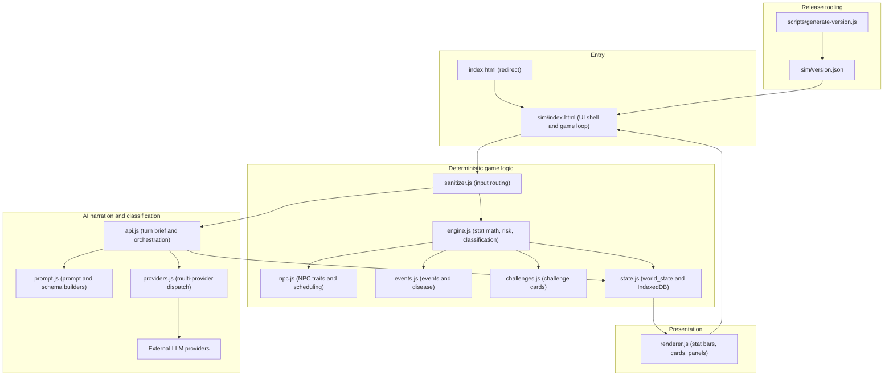

# Architecture

LifeSimulation is a static, build-free Progressive Web App. All application code lives
in the `sim/` directory as ES modules, the repository-root `index.html` redirects into
it, and the `scripts/` directory holds a small Node.js utility for release metadata.

## Top-level layout

| Path | Role |
|---|---|
| `index.html` | Root entry point. A minimal page that redirects the browser to `sim/`. |
| `sim/` | The actual application: UI shell plus all game-logic and AI modules. |
| `scripts/` | Node.js utilities (currently version-manifest generation). |
| `README.md` | Quick start and version-metadata workflow. |
| `sim_blueprint_v2.md` | Detailed design blueprint. |
| `recommendations.md` | Notes on API flexibility and future genre flexibility. |

## The `sim/` application modules

| File | Responsibility |
|---|---|
| `index.html` | UI shell, PWA wiring, and the game-loop coordinator. |
| `engine.js` | Stat math, time advancement, risk rolls, thresholds, and turn-classification constants. |
| `state.js` | The `world_state` manager and persistence via Dexie.js / IndexedDB, plus a structured event index. |
| `sanitizer.js` | Input keyword/pattern detection, three-path routing, and context stripping before classifier calls. |
| `prompt.js` | Builds the narration system prompt and the JSON prompts/schemas for the classifier model. |
| `api.js` | Orchestrates AI calls, assembles the per-turn "turn brief", and manages fallbacks. |
| `providers.js` | Universal provider abstraction; detects the provider from the key and dispatches chat/JSON requests. |
| `npc.js` | NPC profiles, numeric trait arrays, relationship logic, and weekly scheduling. |
| `events.js` | Event tables, disease/illness lifecycle, and condition checks. |
| `challenges.js` | Challenge-card system for significant life events. |
| `renderer.js` | All UI rendering: stat bars, NPC cards, job panel, possessions, and the turn anchor. |
| `manifest.json` | PWA manifest (name, icons, theme). |
| `version.json` | Update manifest read by the app for version checks. |

## The `scripts/` directory

- `scripts/generate-version.js` — a Node.js script that reads git metadata
  (`git describe` / `git rev-parse`) and writes `sim/version.json` (`version` + `date`).
  The app reads this file to detect new releases and show an update banner.

## Component diagram

## How a turn flows

1. The player enters an action in `sim/index.html`.
2. `sanitizer.js` checks for explicit patterns and routes the input to one of three
   paths (explicit / novel non-explicit / routine autopilot).
3. `engine.js` advances time, applies stat formulas, runs risk rolls, checks thresholds,
   and classifies the turn as `ROUTINE`, `NOTABLE`, `CRISIS`, or `DEATH`.
4. For routine non-explicit turns, the cheaper classifier model narrates directly from a
   sanitized state. For notable-or-higher / explicit turns, `api.js` assembles a compact
   turn brief and the creative model narrates.
5. `renderer.js` displays the prose, renders stat bars and NPC/job/possessions panels,
   and appends the turn anchor (time, date, hours elapsed) from code-generated values.
6. `state.js` writes the updated `world_state` to IndexedDB.

## Design principles

- **Deterministic logic, generative prose.** Code owns every number and outcome; the AI
  only describes what already happened.
- **Single source of truth.** Everything reads from and writes to one `world_state`
  object; modules communicate only through it.
- **Token efficiency.** Conversation history is not sent to the models; a structured
  turn brief and rolling context replace it.
- **Provider independence.** `providers.js` abstracts away the specific AI vendor, with
  automatic fallback across providers.

For the full rationale and mechanics, see
[`../sim_blueprint_v2.md`](../sim_blueprint_v2.md).
